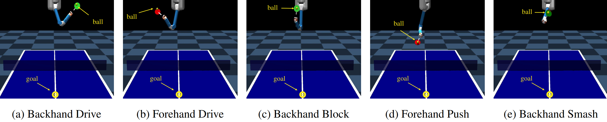

I am a last-year PhD student at the [Autonomous Learning Robots Lab (ALR)] (https://alr.iar.kit.edu/) at [Karlsruhe Institute of Technology (KIT)] (https://www.kit.edu/) supervised by Gerhard Neumann.    

I received both my BSc and MSc in electrical engineering and information technology from the Technische Universität Darmstadt. During my Bachelor's studies
I primarily worked in the Control Methods and Intelligent Systems Group. I focused on machine learning methods during my 
Master's studies and mainly worked in the [Intelligent Autonomous Systems Lab] (https://www.ias.informatik.tu-darmstadt.de/) headed by Jan Peters.  
  

<h2> Research Interests</h2>

My research is centered on equipping autonomous systems with human-like skills that are not only precise but also diverse. 
Humans excel at solving same or similar tasks in versatile ways, which makes them highly adaptable to new and unforeseen situations. 
One of my favorite examples of this adaptability and usage of versatile human-skills is in sports like table tennis, where players can use different techniques (e.g., forehand, backhand) depending on the opponent's strategy.  

  

In recent years, my work therefore has focused on developing [reinforcement learning] (https://arxiv.org/abs/2210.09622) algorithms that enable agents to learn policies 
capable of representing diverse behaviors. These algorithms incorporate techniques from variational inference and curriculum reinforcement learning for [energy-based] (https://arxiv.org/abs/2403.06966) [mixture of experts policies] (https://arxiv.org/abs/2112.04216).  

 

When human demonstration data is available, it is crucial to maximally benefit from the inherent information. For the policy this means that the underlying diversity in the data 
needs to be captured while the policy should generalize well to unseen situations. I am therefore interested in developing algorithms that effectively cover these [diverse human data distributions] (https://arxiv.org/abs/2303.15349) 
while maintaining strong generalization capabilities.

  

Additionally, fine-tuning these imitation-learned policies that exhibit diverse behaviors using reinforcement learning techniques is a promising area of research that can further enhance imperfect policies.  

  
